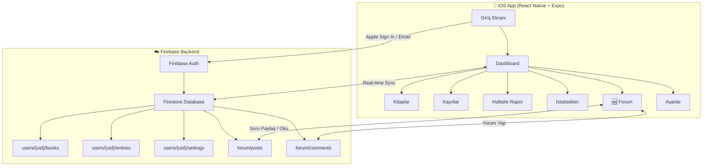
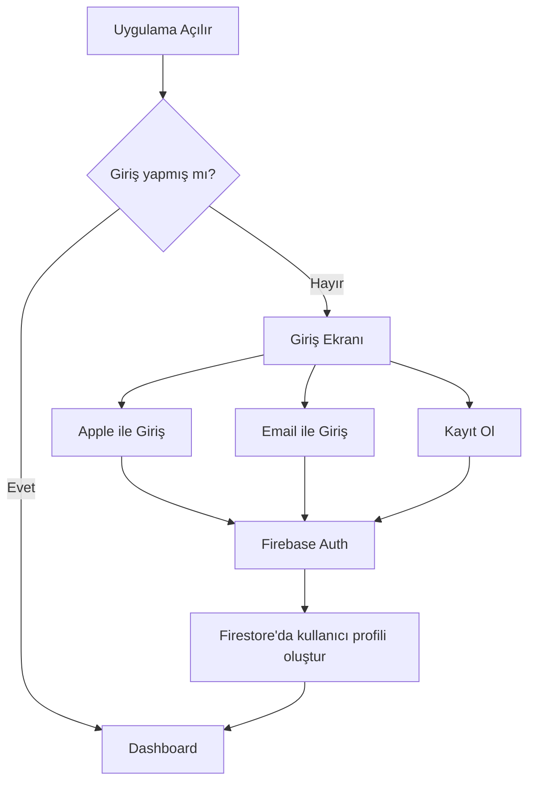

# 🩺 TUS Takip — App Store Yol Haritası

Mevcut web uygulamasını (HTML/CSS/JS + Firebase Realtime DB) kişiye özel, kullanıcı girişli, forum özellikli bir iOS uygulamasına dönüştürme planı.

---

## 📋 Mevcut Durum

| Bileşen | Şu An | Hedef |
|---------|-------|-------|
| Platform | Web (GitHub Pages) | iOS (App Store) |
| Kullanıcı | Herkese açık, tek kullanıcı | Giriş yapan her kullanıcı kendi verisini görür |
| Veritabanı | Firebase Realtime DB (REST API) | Firebase Firestore (kullanıcı bazlı) |
| Kimlik Doğrulama | Yok | Firebase Auth (Email + Apple Sign In) |
| Forum | Yok | Uygulama içi soru paylaşma |
| Teknoloji | Vanilla HTML/CSS/JS | React Native + Expo |

---

## 🔧 Teknoloji Seçimi

### Neden React Native + Expo?

| Alternatif | Avantaj | Dezavantaj | Tercih? |
|-----------|---------|------------|---------|
| **Swift (Native iOS)** | En iyi performans | Sadece iOS, Swift öğrenmek gerek | ❌ |
| **Flutter** | Güzel UI, cross-platform | Dart öğrenmek gerek | ❌ |
| **React Native + Expo** | JS bilginle direkt yazarsın, web kodun %40'ını taşıyabilirsin | Native kadar hızlı değil (ama yeterli) | ✅ |
| **PWA (Web App)** | Mevcut kodu kullanırsın | App Store'a giremez, bildirim kısıtlı | ❌ |

> [!TIP]
> **Expo** kullanmak en mantıklı çünkü:
> - Xcode kurulumu minimum (Expo EAS ile bulutta build alırsın)
> - JavaScript/TypeScript — zaten bildiğin dil
> - Push notification, kamera, haptic feedback gibi native özellikler kolay
> - Expo Go ile telefonda anlık test (kablo bile gerekmez)

---

## 🏗️ Sistem Mimarisi



---

## 🗄️ Veritabanı Tasarımı (Firestore)

### Neden Realtime DB → Firestore?

| Özellik | Realtime DB (Şu an) | Firestore (Yeni) |
|---------|---------------------|------------------|
| Yapı | Tek büyük JSON | Koleksiyon/Doküman (düzenli) |
| Sorgu | Sınırlı | Gelişmiş (filtreleme, sıralama) |
| Güvenlik | Basit rules | Kullanıcı bazlı güçlü rules |
| Forum desteği | Zor | Çok kolay |
| Fiyat | Ücretsiz yeterli | Ücretsiz yeterli (Spark plan) |

### Koleksiyon Yapısı

```
firestore/
├── users/                          ← Kullanıcı koleksiyonu
│   └── {uid}/                      ← Her kullanıcının dokümanı
│       ├── profile                 ← { displayName, email, avatarUrl, createdAt }
│       ├── settings                ← { reviewPercent, dailyGoal, shiftDays, restDays }
│       ├── books/                  ← Alt koleksiyon
│       │   └── {bookId}           ← { name, totalPages, color, createdAt }
│       └── entries/                ← Alt koleksiyon
│           └── {entryId}          ← { date, bookId, pages, type, note, createdAt }
│
├── forum/                          ← Forum koleksiyonu
│   └── posts/                      ← Sorular/Paylaşımlar
│       └── {postId}               ← { authorUid, authorName, title, body, 
│           │                          category, likes, commentCount, createdAt }
│           └── comments/           ← Alt koleksiyon
│               └── {commentId}    ← { authorUid, authorName, body, createdAt }
│
└── metadata/                       ← Genel bilgiler
    ├── categories                  ← Forum kategorileri
    └── appConfig                   ← Uygulama ayarları
```

### Firestore Güvenlik Kuralları

```javascript
rules_version = '2';
service cloud.firestore {
  match /databases/{database}/documents {
    
    // Kullanıcı kendi verisine erişebilir
    match /users/{userId}/{document=**} {
      allow read, write: if request.auth != null && request.auth.uid == userId;
    }
    
    // Forum: herkes okuyabilir, giriş yapanlar yazabilir
    match /forum/posts/{postId} {
      allow read: if request.auth != null;
      allow create: if request.auth != null;
      allow update, delete: if request.auth != null && 
                               request.auth.uid == resource.data.authorUid;
      
      match /comments/{commentId} {
        allow read: if request.auth != null;
        allow create: if request.auth != null;
        allow delete: if request.auth != null && 
                         request.auth.uid == resource.data.authorUid;
      }
    }
  }
}
```

---

## 🔐 Kimlik Doğrulama (Authentication)

### Giriş Yöntemleri

| Yöntem | Zorunlu? | Neden? |
|--------|----------|--------|
| **Apple Sign In** | ✅ Zorunlu | App Store kuralı: sosyal giriş varsa Apple olmalı |
| **Email + Şifre** | ✅ Önerilir | Apple hesabı olmayanlar için yedek |
| **Google Sign In** | ⬜ Opsiyonel | Ek kolaylık |

> [!IMPORTANT]
> **Apple Sign In** App Store'da yayınlamak için **zorunlu**. Eğer herhangi bir üçüncü parti giriş (Google, Facebook vb.) kullanıyorsan, Apple Sign In de sunmak **mecburi**.

### Kullanıcı Akışı



---

## 📱 Uygulama Ekranları

### Ana Sekmeler (Mevcut + Yeni)

| # | Sekme | Mevcut? | Açıklama |
|---|-------|---------|----------|
| 1 | 📊 Dashboard | ✅ Var | İlerleme, hızlı kayıt, motivasyon |
| 2 | 📚 Kitaplar | ✅ Var | Kitap yönetimi |
| 3 | 📝 Kayıtlar | ✅ Var | Çalışma geçmişi |
| 4 | 📅 Haftalık | ✅ Var | Haftalık rapor |
| 5 | 📈 İstatistikler | ✅ Var | Grafikler, streak |
| 6 | 💬 **Forum** | 🆕 Yeni | Soru paylaşma |
| 7 | ⚙️ Ayarlar | ✅ Var | Profil, çıkış |

### 🆕 Forum Ekranı Detayı

```
┌─────────────────────────────────┐
│  💬 TUS Forum                   │
│  ┌─────────────────────────────┐│
│  │ 🔍 Soru Ara...              ││
│  └─────────────────────────────┘│
│                                 │
│  Kategoriler:                   │
│  [Tümü] [Anatomi] [Fizyoloji]  │
│  [Biyokimya] [Patoloji] [Genel]│
│                                 │
│  ┌─────────────────────────────┐│
│  │ 📌 Anatomi sorusu          ││
│  │ Brachial plexus innervation ││
│  │ 👤 İlay · ❤️ 5 · 💬 3       ││
│  │ 2 saat önce                 ││
│  └─────────────────────────────┘│
│  ┌─────────────────────────────┐│
│  │ 📌 Farmakoloji             ││
│  │ Beta-bloker sınıflandırması ││
│  │ 👤 Ahmet · ❤️ 12 · 💬 8     ││
│  │ 5 saat önce                 ││
│  └─────────────────────────────┘│
│                                 │
│        [➕ Soru Sor]            │
└─────────────────────────────────┘
```

---

## 📦 Proje Yapısı (React Native + Expo)

```
tustakip-mobile/
├── app/                          ← Expo Router (dosya bazlı navigasyon)
│   ├── (auth)/                   ← Giriş ekranları
│   │   ├── login.tsx
│   │   └── register.tsx
│   ├── (tabs)/                   ← Ana tab navigasyonu
│   │   ├── index.tsx             ← Dashboard
│   │   ├── books.tsx             ← Kitaplar
│   │   ├── entries.tsx           ← Kayıtlar
│   │   ├── weekly.tsx            ← Haftalık rapor
│   │   ├── stats.tsx             ← İstatistikler
│   │   ├── forum/                ← Forum
│   │   │   ├── index.tsx         ← Post listesi
│   │   │   ├── [id].tsx          ← Post detay + yorumlar
│   │   │   └── create.tsx        ← Yeni soru oluştur
│   │   └── settings.tsx          ← Ayarlar + profil
│   └── _layout.tsx               ← Root layout
├── components/                   ← Paylaşılan bileşenler
│   ├── ui/                       ← Button, Card, Input vb.
│   ├── charts/                   ← Grafik bileşenleri
│   └── forum/                    ← Forum bileşenleri
├── lib/                          ← Yardımcı fonksiyonlar
│   ├── firebase.ts               ← Firebase yapılandırması
│   ├── auth.ts                   ← Auth hookları
│   ├── firestore.ts              ← Firestore CRUD
│   └── utils.ts                  ← Hesaplama fonksiyonları (mevcut app.js'den)
├── hooks/                        ← Custom React hookları
│   ├── useAuth.ts
│   ├── useBooks.ts
│   ├── useEntries.ts
│   └── useForum.ts
├── constants/                    ← Sabitler (renkler, motivasyon vb.)
├── assets/                       ← İkon, resim, font
├── app.json                      ← Expo yapılandırması
├── eas.json                      ← EAS Build yapılandırması
└── package.json
```

---

## 🚀 Geliştirme Aşamaları

### Faz 1: Temel Kurulum (1-2 hafta)
- [ ] Expo projesi oluştur (`npx create-expo-app`)
- [ ] Firebase projesi güncelle (Firestore aktif et)
- [ ] Firebase Auth kur (Apple Sign In + Email)
- [ ] Temel navigasyon yapısı (Tab Navigator)
- [ ] Giriş / Kayıt ekranları
- [ ] Koyu tema + tasarım sistemi (mevcut CSS'den ilham)

### Faz 2: Çekirdek Özellikler (2-3 hafta) 
- [ ] Dashboard ekranı (mevcut web'den taşı)
- [ ] Kitap yönetimi (CRUD)
- [ ] Kayıt ekleme / düzenleme / silme
- [ ] Firestore'a gerçek zamanlı senkronizasyon
- [ ] Mevcut verileri Realtime DB'den Firestore'a migrasyon scripti

### Faz 3: İleri Özellikler (2-3 hafta)
- [ ] Haftalık rapor ekranı
- [ ] İstatistikler + grafikler (react-native-chart-kit veya Victory)
- [ ] Streak hesaplama + motivasyon
- [ ] Push notification (günlük hatırlatma)

### Faz 4: Forum (2-3 hafta)
- [ ] Forum ana ekranı (post listesi)
- [ ] Soru oluşturma ekranı
- [ ] Post detay + yorum sistemi
- [ ] Kategoriler ve arama
- [ ] Beğeni sistemi
- [ ] Bildirimler (birine yorum geldiğinde)

### Faz 5: App Store (1-2 hafta)
- [ ] App Store Connect hesabı aç
- [ ] Uygulama ikonları ve splash screen
- [ ] App Store ekran görüntüleri hazırla
- [ ] Gizlilik politikası yaz
- [ ] EAS Build ile production build al
- [ ] App Store'a gönder + Review süreci

---

## 💰 Maliyet Analizi

| Kalem | Maliyet | Sıklık | Not |
|-------|---------|--------|-----|
| **Apple Developer Account** | $99 (~3.200 ₺) | Yıllık | App Store'a yüklemek zorunlu |
| **Firebase (Spark Plan)** | Ücretsiz | - | 1GB Firestore, 50K okuma/gün yeterli |
| **Expo EAS Build** | Ücretsiz (30 build/ay) | Aylık | Ücretsiz plan yeterli |
| **Domain (gizlilik politikası)** | Mevcut GitHub Pages | - | Mevcut site kullanılabilir |
| **Toplam İlk Yıl** | **~$99 (3.200 ₺)** | | |

> [!NOTE]
> En büyük maliyet **Apple Developer Account** ($99/yıl). Firebase ve Expo ücretsiz planları bu uygulama boyutu için fazlasıyla yeterli.

---

## 📚 Kullanılacak Kütüphaneler

| Kütüphane | Amaç |
|-----------|------|
| `expo` | Temel framework |
| `expo-router` | Dosya bazlı navigasyon |
| `@react-native-firebase/app` | Firebase SDK |
| `@react-native-firebase/auth` | Kimlik doğrulama |
| `@react-native-firebase/firestore` | Veritabanı |
| `expo-apple-authentication` | Apple Sign In |
| `react-native-chart-kit` | Grafikler |
| `expo-notifications` | Push bildirimler |
| `expo-haptics` | Dokunsal geri bildirim |
| `@expo/vector-icons` | İkonlar |
| `react-native-reanimated` | Animasyonlar |
| `expo-linear-gradient` | Gradient arkaplanlar |

---

## 🔄 Mevcut Verinin Taşınması

Mevcut Firebase Realtime DB'deki verileri yeni Firestore yapısına taşımak için bir migrasyon scripti yazılacak:

```
Mevcut yapı (Realtime DB):          Yeni yapı (Firestore):
tus/                                users/{uid}/
  ├── entries: [...]       →          ├── entries/{entryId}: {...}
  ├── books: [...]         →          ├── books/{bookId}: {...}
  └── settings: {...}      →          └── settings: {...}
```

> [!IMPORTANT]
> Migrasyon sırasında mevcut web uygulaması da çalışmaya devam edebilir. İsteğe göre web versiyonunu da Firestore'a güncelleyebiliriz.

---

## ⏱️ Toplam Tahmini Süre

| Faz | Süre | Kümülatif |
|-----|------|-----------|
| Faz 1: Temel Kurulum | 1-2 hafta | 2 hafta |
| Faz 2: Çekirdek Özellikler | 2-3 hafta | 5 hafta |
| Faz 3: İleri Özellikler | 2-3 hafta | 8 hafta |
| Faz 4: Forum | 2-3 hafta | 11 hafta |
| Faz 5: App Store | 1-2 hafta | **~3 ay** |

> [!TIP]
> **Toplam: ~3 ay** (haftada ~10-15 saat çalışma ile). Eğer sadece temel özellikleri istersen (forum hariç), **~2 ayda** App Store'da olabilir.

---

## 🤔 Açık Sorular

> [!IMPORTANT]
> Bu soruların cevapları planı şekillendirecek:

1. **Web versiyonu devam edecek mi?** Mobil çıktığında web'i kapatacak mısın, yoksa ikisi de çalışsın mı?

2. **Forum kimlere açık olacak?** Sadece siz ikiniz mi, yoksa tüm TUS çalışan kullanıcılar mı?

3. **Apple Developer hesabın var mı?** Yoksa $99 ödemeye hazır mısın?

4. **Bildirimler isteniyor mu?** "Bugün henüz çalışmadın!" gibi hatırlatma push notificationları?

5. **Android da olsun mu?** React Native ile hem iOS hem Android çıkabilir. Sadece iOS mi yoksa ikisi de mi?

6. **Ne zaman başlamayı düşünüyorsun?** En erken ne zaman geliştirmeye başlayabiliriz?
