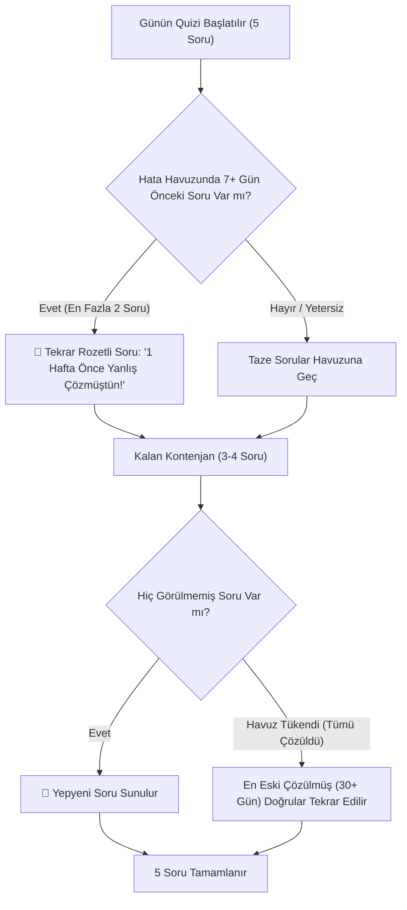
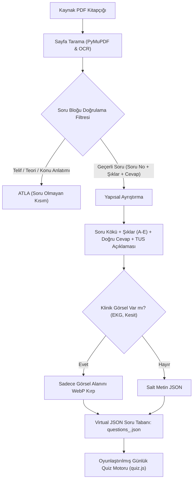

# 🎯 TUS Soru Bankası & Virtual Soru Tabanı Pipeline Planı (v4.3.0)

Bu plan, **[cikmis_sorular/](file:///c:/Users/canbe/Desktop/projeler/New%20folder/tustakip/cikmis_sorular)** klasörüne eklenecek farklı TUS kitaplarındaki (Fizyoloji, Patoloji, Dahiliye vb.) çıkmış ve deneme sorularını **konu anlatımlarından, kapaklardan ve soru olmayan kısımlardan akıllıca ayırt ederek**, kitap bazlı **yapay (hafif) JSON** sanal soru tabanlarında depolama, **5.000+ soru takip sistemi** ve **aralıklı tekrar (spaced repetition)** oyunlaştırma pipeline'ını tanımlar.

---

## 🔬 1. Temel İlke: Soru Olmayan Kısımları Kesmeme & Hafif JSON Mimarisi

TUS kitapları heterojendir:
1. Bazı kitaplar yalnızca sorulardan oluşur (Fizyoloji Çıkmış Sorular gibi).
2. Bazı kitaplarda sorular **konu anlatımlarının aralarına serpiştirilmiştir** (Özet spot bilgiler, tablolar, vaka anlatımları ve aralarda tek tük sorular).
3. Sayfalarda telif uyarıları, bölüm kapakları ve dipnotlar bulunur.

### 🚫 Neden Bazı PNG Kırpmaları Yanlıştı? (Öğrenilen Dersler & Hatalar):
- ❌ **Körlemesine Bounding-Box / Görsel Kırpma:** İlk testlerde sayfa içerisindeki görsel bloklar filtrelenmeden kesildiğinde, *"Telif hukuku, kul hakkı, fotokopi..."* gibi yasal uyarılar, ünite başlıkları ve özet tabloları soru sanılarak PNG'ye dönüştürüldü. Bu durum hem yanlış sorular üretti hem de gereksiz depolama yarattı.
- ❌ **Devasa PNG Yığınları:** 500 soru için 500 ayrı görsel üretmek yüzlerce megabayt yer tutar, git reposunu ve GitHub Pages kotasını şişirir.
- ❌ **Soru Olmayan Şeyleri Kesmeme Kuralı:** Soru formatında olmayan hiçbir teorik bilgi, kapak veya dipnot **kırpılmaz, kesilmez ve soru tabanına dahil edilmez**.

### 🧩 Aralarda Soru Olan Karma Kitaplar (Patoloji, Dahiliye vb.) Stratejisi:
Karma kitaplarda (konu anlatımı + aralara serpiştirilmiş sorular) uygulanacak cerrahi yöntem:
1. Sayfanın tamamı veya blokları körlemesine taranmaz.
2. Metin akışında **sentaks sınır belirleyiciler (syntax delimiters)** kullanılır:
   - Soru Başlangıç Sınırı: `^\d{1,3}\.\s*` (Örn: `1. `, `14. `) + Vaka veya soru kökü.
   - Şık Gövdesi: `A)`, `B)`, `C)`, `D)`, `E)` harflerinin alt alta veya yan yana tam dizilimi.
   - Cevap & Çözüm Sınırı: `Doğru cevap:` veya `Cevap:` anahtar kelimesi.
   - Bitiş Sınırı: Çözüm açıklamasının sonu veya bir sonraki konunun başlığı.
3. Bu 4 unsuru taşımayan aradaki tüm konu anlatımı, spot bilgi kutuları ve tablolar **tamamen yoksayılır (skip)**.

### ✅ Uygulanacak "Virtual Soru Tabanı" Kuralı:
1. **Yalnızca Gerçek Soruları Ayıkla:** Soru kökü, şıkları (A-E) ve cevap anahtarı olmayan hiçbir alan kesilmez veya soru tabanına dahil edilmez.
2. **Kitap Bazlı Yapay JSON Deposu:** Her kitap kendi adıyla optimize edilmiş bir JSON dosyasında tutulur:
   - `cikmis_sorular/virtual_db/questions_fizyoloji.json`
   - `cikmis_sorular/virtual_db/questions_dahiliye.json`
   - `cikmis_sorular/virtual_db/questions_patoloji.json`
   - vb.
3. **Ultra Düşük Boyut (~35 KB / 100 Soru):**
   - Soruların %90'ı salt metindir. Bunlar metin, şıklar, doğru cevap ve açıklama olarak doğrudan JSON içinde saklanır (sıfır görsel maliyeti).
   - **Görsel Kuralı:** YALNIZCA soruda gerçek bir klinik tanı görseli (EKG dalgası, Patoloji mikroskop kesiti, Radyoloji BT/MR görüntüsü) varsa o spesifik görsel alanı kırpılır ve WebP formatında `assets/questions/` altına optimize kaydedilerek JSON'a `image` olarak bağlanır.

---

## 🔁 2. Aralıklı Tekrar (Spaced Repetition) & 5.000+ Soru Takip Motoru

Kullanıcının kritik vizyonu:  
> *"hep aynı soruları sormamak için bir sistem yapmamız gerekiyor. Eğer hatalı çözdüyse soruyu daha önce, 1 hafta sonra aynı soru çıktığında '1 hafta önce bunu yanlış çözdün, hadi tekrar dene' tarzında tekrar sorsun. Zamanla 5.000'den fazla soru olacak, hep aynı soruları sormayalım."*

### 🧠 Akıllı Soru Seçim Algoritması (Günlük 5 Soru Dağılımı):
Zamanla 5.000'den fazla soru birikeceği için günlük 5 soru rastgele seçilmeyecektir. Akıllı bir pedagojik matris uygulanır:



### 🏷️ Özel Soru Kartı Rozeti:
1 hafta önce yanlış yapılan bir soru tekrar geldiğinde soru kartının en üstünde dikkat çekici bir rozet belirir:
```html
<div class="quiz-review-alert-badge">
  <span>🔄 1 Hafta Önce Bu Soruda Yanılmıştın!</span>
  <small>Bakalım konuyu pekiştirdin mi? Hadi intikam vakti! 💪</small>
</div>
```

### 💾 Kompakt Çözüm Geçmişi (Firebase Dostu):
Her kullanıcının profilinde soru geçmişi ultra hafif bir harita olarak saklanır:
```json
{
  "questionHistory": {
    "fizyoloji_q2": { "status": "wrong", "lastDate": "2026-09-08", "nextReview": "2026-09-15", "wrongCount": 1 },
    "fizyoloji_q1": { "status": "correct", "lastDate": "2026-09-15", "nextReview": "2026-10-15", "wrongCount": 0 }
  }
}
```
*Bu yapı sayesinde 1.000 soru çözülse bile veri boyutu sadece **~8-12 KB** kalır; Firebase Realtime Database asla yorulmaz.*

---

## 🛠️ 3. Akıllı Soru Ayıklama Boru Hattı (Extraction Pipeline)



### 🔍 Soru Doğrulama Filtresi (False-Positive Eliminator):
Bir bloğun soru tabanına girmesi için şu **4 şartı birden** sağlaması zorunludur:
1. **Soru Numarası & Başlık:** Sayı ile başlar (`^\d{1,3}[\.\)]`) ve genellikle sınav dönemini taşır (`(Nisan-2001)`, `(Eylül-99)`).
2. **Şık Bütünlüğü:** `A)`, `B)`, `C)`, `D)`, `E)` seçeneklerinin eksiksiz bulunması. Şıkları olmayan konu anlatım paragrafları derhal elenir.
3. **Cevap Anahtarı:** `Doğru cevap: [A-E]` veya `Cevap: [A-E]` ibaresi bulunmalıdır.
4. **TUS Püf Noktası (Açıklama):** Soruya ait çözüm ve klinik püf noktası metni ayrıştırılır.

---

## 🗄️ 4. Sanal Soru Tabanı Veri Modeli (Schema)

Her kitap için üretilecek JSON dosyasındaki soru şeması:

```json
{
  "id": "fizyoloji_q1",
  "book": "Fizyoloji",
  "exam": "Nisan 2001 TUS",
  "subject": "Fizyoloji",
  "topic": "Hücre Bölünmesi (Mitoz)",
  "question": "Kromozomlar hücre bölünmesinde hangi evrede ekvatoryal düzeyde dizilim gösterirler?",
  "hasImage": false,
  "image": null,
  "options": {
    "A": "İnterfaz",
    "B": "Profaz",
    "C": "Metafaz",
    "D": "Anafaz",
    "E": "Telofaz"
  },
  "answer": "C",
  "explanation": "Ekvatoryal dizilim = Metafazın en önemli özelliğidir. Karyotip analizi de bu evrede yapılır."
}
```

---

## 👥 5. Kullanıcı İzolasyonu ve Veri Güvenliği (Kritik Düzeltme)

Kullanıcının uyarısı: *"testi yaparken izledim seni kullanıcı z aslında galiba ilayın verilerini görüyor"*

### Tespit Edilen Nedenler & Uygulanan Çözümler:
1. **Erken Yükleme (Unauthenticated Init):**
   - **Hata:** `init()` fonksiyonu kimlik doğrulama tamamlanmadan önce `loadData()` ve `syncFromFirebase()` çalıştırıyor ve varsayılan olarak İlay'ın verilerini hafızaya alıyordu.
   - **Çözüm:** `loadData()` ve `syncFromFirebase()` çağrıları `initAuthAndSession()` sonrasına, kullanıcı oturumu kesinleştikten sonraya taşındı. Oturum yoksa hafıza tamamen boş kalır.
2. **Kullanıcı Z ve Yeni Kullanıcıların Boş Veri Durumu:**
   - **Hata:** Yeni kullanıcının Firebase verisi boş (`null`) geldiğinde hafızadaki eski veriler temizlenmiyordu.
   - **Çözüm:** `syncFromFirebase()` içinde `!data` durumu yakalandı; kullanıcı `ilay` değilse boş çalışma kayıtları ve 0 okunan sayfa ile standart şablon atanarak Firebase'e ve yerel depolamaya izole kaydedildi.
3. **İlay'a Özel Yüzen Not (Partner Note):**
   - **Hata:** Canberk'in İlay'a yazdığı özel motivasyon notu diğer kullanıcılarda da tetiklenebiliyordu.
   - **Çözüm:** `updatePartnerNote()` fonksiyonuna katı `activeStudent === 'ilay'` şartı eklendi. Kullanıcı Z, X veya Canberk giriş yaptığında bu not asla görüntülenmez.

---

## 📋 6. Yapılanlar ve İlerleyiş Durumu (Checklist)

- [x] Kullanıcı Z ve yeni kayıt olan öğrencilerin İlay'ın verilerini görme açığı giderildi ve katı izolasyon sağlandı.
- [x] İlay'a özel yüzen partner notunun diğer kullanıcılarda gizlenmesi sağlandı.
- [x] İlk 7 soruluk doğrulanmış Fizyoloji çıkmış soru tabanı `cikmis_sorular/virtual_db/questions_fizyoloji.json` olarak kuruldu.
- [x] 13 TUS dersi soru takip manifestosu (`question_bank_manifest.json`) oluşturuldu.
- [x] Dashboard'a ders bazlı soru dağılımını gösteren detaylı modal (`quizPoolModal`) entegre edildi.
- [x] Günlük 5 soruluk Duolingo tarzı mini-quiz motoru (`quiz.js`, `style.css`) çalışır hale getirildi.
- [x] Aralıklı Tekrar (Spaced Repetition) ve 5.000+ soru havuzu takip mekanizması kodlandı (`_isReview`, `_daysAgo`, `"1 Hafta Önce Yanlış Çözmüştün!"` rozeti).
- [x] `extract_questions.py` aracına soru olmayan kısımları (telif, kapak, salt teori) atlama ve manifestoyu otomatik senkronize etme yeteneği eklendi.
- [ ] **Sıradaki Adım 1:** Fizyoloji kitabındaki diğer üniteleri (Dolaşım, Solunum, Boşaltım vb.) toplu taratıp manifestoya eklemek.
- [ ] **Sıradaki Adım 2:** İkinci bir branşın kitabını (örn. Patoloji veya Dahiliye) ekleyip aynı hafif JSON pipeline'ını çalıştırmak.
- [ ] **Sıradaki Adım 3 (Katı Kural):** ASLA canlıya çıkılmayacak. En az 2 farklı kitaptan (Fizyoloji + 1 diğer ders) soru tabanı oluşturulup yerel ortamda (`http://localhost:8080`) kusursuz çalıştığı doğrulanmadan canlıya (GitHub Pages) dağıtım yapılmayacak.

---

## 🚀 7. Yarın Devam Ederken: Yeni Kitap Ekleme ve Ayıklama Rehberi (Adım Adım)

Yarın yeni bir kitap (örn. `Dahiliye.pdf` veya `Patoloji.pdf`) eklendiğinde veya mevcut Fizyoloji genişletildiğinde izlenecek kesin adımlar:

### Adım 1: PDF Dosyasını Yerleştirme
- Yeni PDF'i doğrudan [cikmis_sorular/](file:///c:/Users/canbe/Desktop/projeler/New%20folder/tustakip/cikmis_sorular) içine atın (Örn: `cikmis_sorular/Dahiliye.pdf`).
- `.gitignore` zaten `cikmis_sorular/*.pdf` kuralını içerdiği için bu devasa dosya asla git reponuzu veya GitHub kotanızı doldurmaz.

### Adım 2: Akıllı Ayıklama Scriptini Çalıştırma
```powershell
python extract_questions.py cikmis_sorular/Dahiliye.pdf --subject dahiliye
```
**Script Arka Planda Ne Yapar?**
1. Sayfa sayfa tarar; telif, kapak, salt özet ve konu anlatımı tablolarını otomatik eler (**asla kesmez**).
2. Metin içinde `^\d+\.`, `A-E` şık dizisi ve `Doğru cevap:` eşleşmesi arar.
3. Soruyu ayrıştırıp `cikmis_sorular/virtual_db/questions_dahiliye.json` dosyasına hafif formatta yazar.
4. Merkezi `question_bank_manifest.json` dosyasını açar:
   - Dahiliye soru sayısını (`questionCount`) günceller.
   - Alt konu kategorilerini (`categories`) günceller.
   - En tepedeki `totalQuestions` değerini otomatik artırır.

### Adım 3: Soru Doğrulama & Çift Kontrol
- Üretilen `cikmis_sorular/virtual_db/questions_<kitap>.json` dosyasını açıp ilk 3-5 sorunun şıklarını ve cevaplarını gözle kontrol edin.
- Şık veya cevap eksikliği olan kayıtlar varsa filtreleme kuralları bunları zaten atlamıştır; kalanlar %100 temiz sorulardır.

### Adım 4: Yerel Test & Canlıya Geçiş Şartı
- `http://localhost:8080` üzerinde Dashboard'daki `📚 Havuz: X Soru [🔍 Detay]` butonuna tıklayarak yeni dersin ve soruların göründüğünü test edin.
- **⛔ KATI CANLIYA ÇIKMA KURALI:** En az 2 farklı kitaptan (Fizyoloji + 1 diğer branş kitabı) soru tabanı eklenip yerelde tam test edilmeden **ASLA canlıya (GitHub Pages) çıkılmayacak**. Tüm süreç yerel ortamda yürütülecektir.

